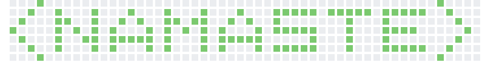
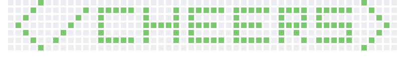

  
   

- ## This is Shubham Bhandari  
  

- 🏫 Currently pursuing Masters in Data Science and Business Analytics at ESSEC Business School and CentraleSupélec.  
  

- 💻 If you have a data science or machine learning project, I may be your man.  
  

- ⚡ Fun fact: I prefer tabs over spaces.  
  

- 👨‍💻 To know more about me visit [EssBee](http://essbee.me)  
  

   

## My Skill Set  

<table><tr><td valign="top" width="33%">

### Programming Languages  

   
  
  

  

</td><td valign="top" width="33%">

### AI/ML  

  
  
  
  
  

  

### Devops  

  
  
  
  
  

</td><td valign="top" width="33%">

### Database  

  
  
  

  

### Other  

  
  
  
  
  
  
  
  
  

</td></tr></table>  

   

## Connect with me

<!--  -->

  

  
  

   

## Recent Medium Posts  

   

## Stats  

<table><tr>
<td valign="top" width="50%">

</td>
<td valign="top" width="50%">

</td></tr></table>  
 

<!-- 

    -->

## Fun Zone

<table><tr><td valign="top" width="50%">

### My Music 🎵

 

<!--  -->

</td><td valign="top" width="50%">

### Programming Joke 🤪

 

  

</td></tr></table>  

<!--    

  
  

    -->
<bt/>

## Support Me

            
            
  

   

### You are visitor Number

 

  

 

